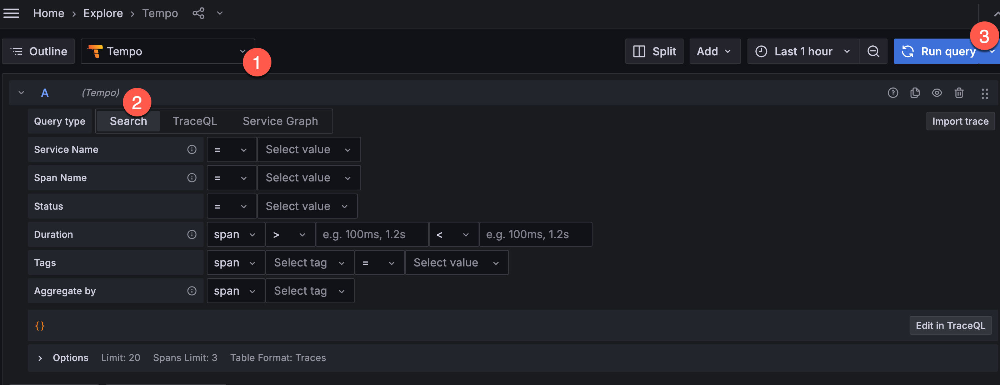
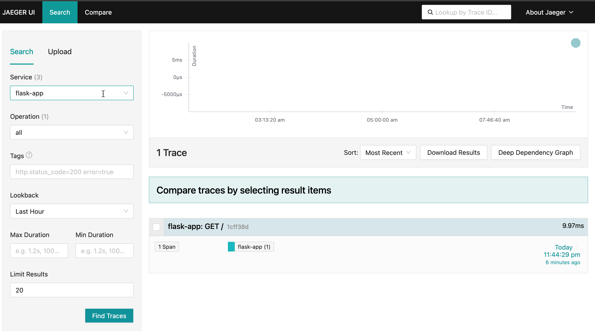
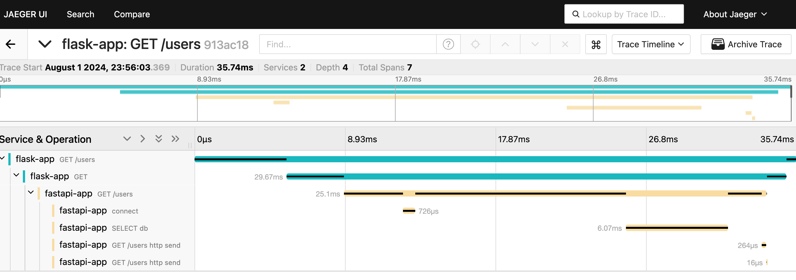

# Python Demo Apps with OpenTelemetry Traces, Logs and Metrics

Набор различных способов добавления OpenTelemetry-библиотек (инструментация) в приложения написанные на Python с использованием фреймворков Flask, FastAPI

Набор готовых настроек в виде Docker-контейнеров для быстрого запуска сервисов для работы с метриками, логами и трейсами:
- [`Grafana`](http://localhost:3000/) - UI для работы с трейсами, логами и метриками
- [`Jaeger UI`](http://localhost:16686/) - UI и хранилище для трейсов
- [`Prometheus`](http://localhost:9090/) - хранилище метрик
- `OpenTelemetry Collector` - сбор и обработка OpenTelemetry-данных
- `Loki` - хранилище логов
- `Tempo` - хранилище трейсов

## Описание архитектуры

### Описание архитектуры пользовательских сервисов

TODO

### Описание архитектуры инфраструктуры для мониторинга

TODO

## Быстрый старт

Запустить все сервисы
```
docker-compose up -d
```

Выполнить запрос к edge-сервису (`flask-app`):
```
curl http://127.0.0.1:8001/users
```

Найти запрос в UI:
- Открыть [`Grafana`](http://localhost:3000/explore), выбрать `Tempo`, переключиться в тип запроса `Search` и нажать `Run query`:
  
- Открыть [`Jaeger UI`](http://localhost:16686/), выбрать сервис внутри `Services` и нажать `Find Traces`:
  

Открыть трейс запроса и получить всю информацию по спанам:
- Grafana:
  
- Jaeger UI:
  

Остановить сервисы
```
docker-compose down -v
```
